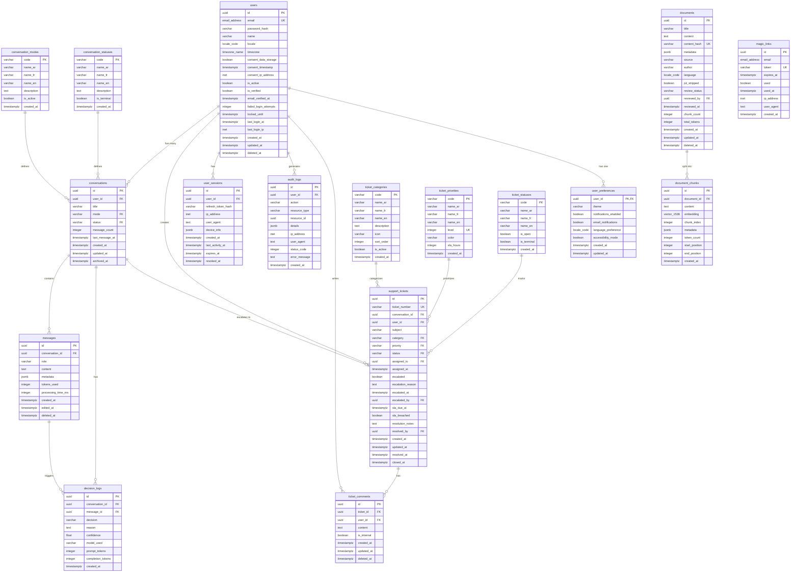
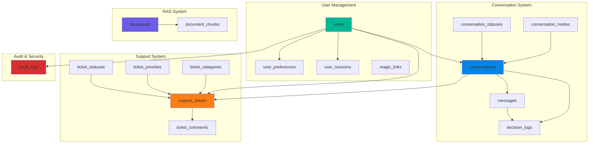
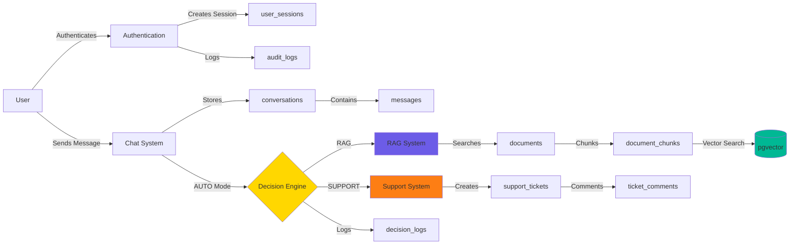
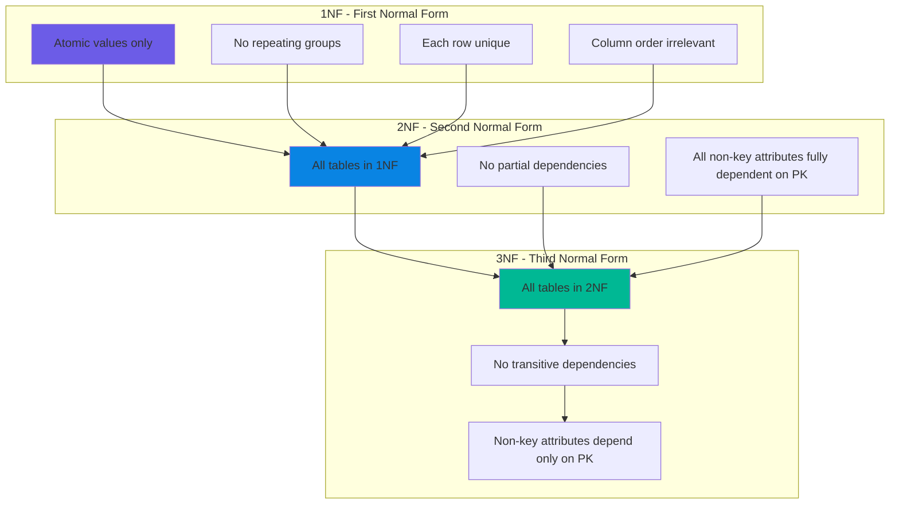
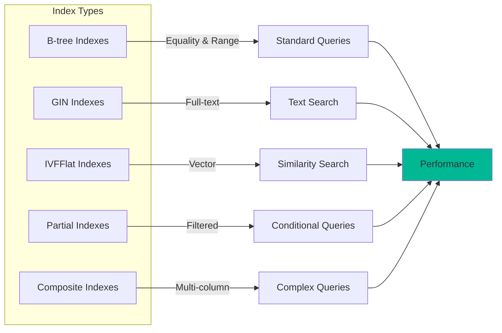
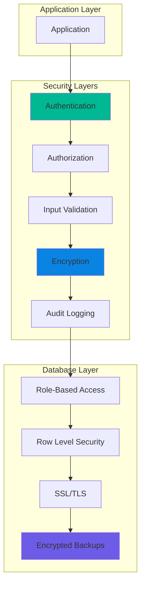
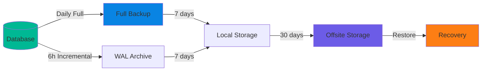
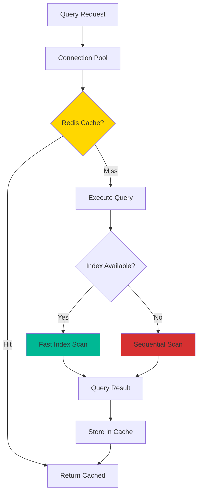

# Amal Chat Platform - Database Schema

## Entity Relationship Diagram

## Database Architecture Diagram

## Data Flow Diagram

## Normalization Diagram

## Index Strategy Diagram

## Security Layers Diagram

## Backup Strategy Diagram

## Performance Optimization Flow

